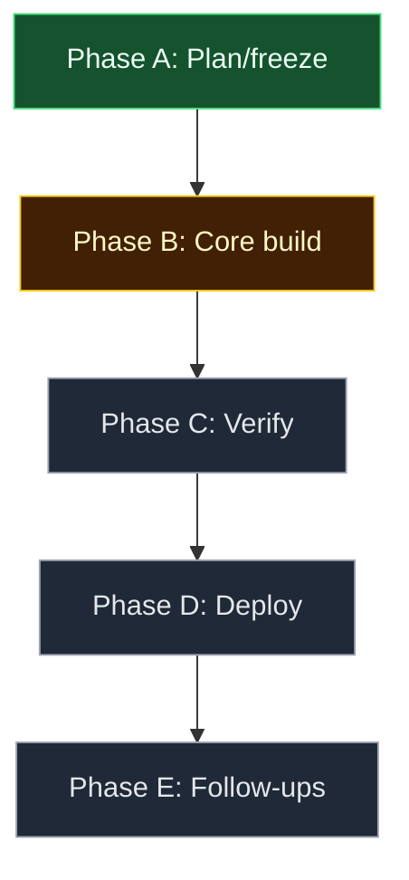

> Personal project, no Linear tracker. Source of truth for the v2 implementation
> (pinning, tools tier, favicons, homepage/PWA onboarding). Supersedes the
> standalone `DESIGN.md`, which is removed at lock time — this file is now the
> only design doc for the capability.

Grounded in the current codebase: [`index.html`](../../index.html) is a
self-contained static page — hardcoded `PROJECTS` array (16 entries), search +
5 filter buttons, no persistence, no icons, no PWA assets. Production is
deployed from a one-off MCP file upload and is **not** git-linked to this
repo, so pushes here do not auto-deploy.

---

## 1. User story

**As the site owner, I want my homepage to surface my most-used apps and dashboards first — pinned, iconed, and installable — so that every new tab starts one click from where I'm going.**

### Acceptance criteria (MVP)

| # | Criterion |
|---|---|
| AC1 | Every card (tool or project) has a star toggle; starring moves it into a Pinned row at top; state survives reload via `localStorage` |
| AC2 | Pin ids that no longer match any item are ignored on read and pruned on next write (no ghost cards, no console errors) |
| AC3 | Tools section renders flagship apps (Tabletop Studio, Scrybe, AI Lab) and platform cards (GitHub, Vercel, Supabase, Stripe, Linear, Sentry, PostHog) with per-domain favicons |
| AC4 | A favicon that fails to load is replaced by a letter-tile fallback — no broken-image glyphs under any network condition |
| AC5 | Search matches tools as well as projects (name/desc/tags); Tools row highlights matches rather than hiding non-matches |
| AC6 | Homepage banner detects the browser via `navigator.userAgentData?.brands` (fallback: manual tabs) and shows correct set-as-homepage steps; dismissal persists |
| AC7 | On Chromium, when `beforeinstallprompt` fires, an "Install app" secondary button appears and triggers the native prompt; absent otherwise |
| AC8 | `/` or `Ctrl+K` focuses search, `Esc` clears, `Enter` opens the first visible result; filter buttons and star toggles expose `aria-pressed` |
| AC9 | "Live only" filter removed; `--text-faint` contrast >= 4.5:1 on card background |

### Non-goals (v1 of this change)

- Runtime GitHub/Vercel data sync (decided: static, hand-edited)
- Cross-device pin sync, auth, any server code
- Service worker / offline caching
- Programmatic homepage setting (impossible in modern browsers)

### Alignment

Owner-approved via two rounds of clarifying questions (data-freshness, tools
list, favicon source, homepage UX) plus this SPEC's S5/S6 round below.

---

## 2. UI/UX design

### Problem today

| Element | Current | Expectation |
|---|---|---|
| Card ordering | 16 equal cards, alphabetical-ish | My daily 3-4 always first |
| Dashboards | 3 small text quick-links | First-class iconed cards |
| Hero | ~340px before first card | One line, links immediately |
| Search | Projects name/desc only | Finds anything on the page |

### State model

```text
PAGE:   DEFAULT -> SEARCHING (query non-empty) -> DEFAULT (Esc/clear)
BANNER: COLLAPSED -> EXPANDED (click) -> DISMISSED (persisted)
CARD:   UNPINNED <-> PINNED (star toggle, persisted)
```

Rules: Pinned/Tools rows never hide during SEARCHING (Tools matches
highlight; Pinned unaffected). BANNER: DISMISSED is terminal except via
footer "homepage setup" link.

### Wireframe

```text
+ Header: [S] Stockwise Productions            clock +
| Tagline line + quick links (one row)               |
| [i] Make this your homepage - [steps v] [Install]  |  <- banner (until dismissed)
| PINNED       * card  * card  * card                |  <- only if pins exist
| TOOLS        [ic] Tabletop  [ic] Scrybe  [ic] AI Lab   (green edge)
|              [ic] GitHub [ic] Vercel [ic] Supabase ... (blue edge)
| PROJECTS     [search] [All][AI][Tabletop][Tools]  n of 16
|              full cards w/ star, favicon, Visit/Code   |
+ Footer: repo link - homepage setup - last synced   +
```

### Entry points, conflicts, accessibility, mobile

- **Entry:** page load (new tab) is the only entry; everything above the
  fold at 1280x800.
- **Conflict:** flagship apps exist in both Tools and Projects (S6-Q4: keep
  both) — same `id`, one shared pin state; pinning from either location
  stars both instances.
- **Pinned card format** (S6-Q1: compact): pinned cards use the compact
  tool-card shape (icon + name + Open) regardless of source type; the repo
  link for a pinned project remains one click away in the Projects grid.
- **A11y:** star = `<button aria-pressed>` >=40px target; filters get
  `aria-pressed`; banner expand is a disclosure control; favicons `alt=""`.
- **Mobile:** Tools cards wrap 2-up; pinned row horizontal-scrolls; banner
  collapses to a link.

---

## 3. Engineering spec

### Data model (replaces `PROJECTS`)

```js
ITEMS = [{ id, type: "app"|"tool"|"project", name, desc, url, domain, repo?, lang?, tags? }]
// pins: localStorage["stockwise-hub:pins:v1"] = JSON array of ids (order = display order)
// banner: localStorage["stockwise-hub:banner-dismissed:v1"] = "1"
```

### Components / modules (all inline in `index.html`)

| Artifact | Change |
|---|---|
| `ITEMS` array | New unified data; flagship apps carry both `app` type and project-grid presence |
| `renderPinned()` / `renderTools()` / `renderProjects()` | Three render fns off one filtered view |
| `favicon(domain)` | ` letter-tile>` |
| `pinStore` | get/toggle/prune wrapper around localStorage with try/catch (private-mode safe) |
| `banner` | `userAgentData?.brands` detection -> instruction set; manual browser tabs fallback; `beforeinstallprompt` capture |
| `manifest.webmanifest` + `icon-192.png`/`icon-512.png` | New files; dark "S" tile PNGs |
| Keyboard handler | `/`, `Ctrl+K`, `Esc`, `Enter` |

### Data / API / flags

No schema, no server, no flags. External dependency: Google s2 favicon
endpoint (read-only, no keys, no auth).

### Interaction rules

| Event | Behavior |
|---|---|
| Star click | Toggle id in pins, prune orphans, re-render Pinned + source card state |
| Search input | Filter Projects; highlight Tools matches; live count update |
| `Enter` in search | `window.open` first visible result |
| `beforeinstallprompt` | `preventDefault()`, stash event, reveal Install button |
| Favicon `onerror` | Swap to letter-tile, never retry |

### Tests

No test harness in repo and none warranted for one static file. Verification
is manual via the `/verify` flow (Phase C below): pin persistence across
reload, orphan pruning (edit id in devtools), favicon fallback (block
googleusercontent), banner dismissal persistence, install prompt on
Chromium, keyboard map, mobile viewport.

### Observability

None (static personal page; no analytics by design).

---

## 4. Feedback

### Strengths

- Stays zero-build/single-file; pinning gives the page a reason to be the
  homepage; all open decisions are now owner-ratified.

### Risks / open tensions

| Risk | Mitigation |
|---|---|
| Repo <-> production drift (Vercel not git-linked) | S6-Q2: dual-path documented in README as mandatory until git-linked (Phase E follow-up) |
| Google favicon proxy outage/low-res | Letter-tile fallback (AC4); domains cached by browser |
| `localStorage` unavailable (private mode) | try/catch wrapper; page degrades to v1 behavior silently |
| Banner adds clutter to a page built for speed | Slim single line, terminal dismissal, footer re-entry |

---

## 5. Clarifying questions (resolved)

1. Pinned card format — compact (icon + name + Open), losing the repo link
   while pinned?
2. Deploy discipline — git-link the repo to the Vercel project, or keep the
   dual-path (push + MCP upload every time)?
3. Install button — keep PWA install as the banner's secondary action, or
   drop it and ship homepage instructions only?
4. Flagship duplication — apps in both Tools row and Projects grid, or
   Tools-only to cut repetition?

---

## 6. Default stance (accepted 2026-07-17)

| Question | Default (accepted) |
|---|---|
| Q1 | Compact pinned cards; repo link remains one click away in the grid |
| Q2 | Dual-path documented in README as mandatory; git-link recommended when owner next visits Vercel |
| Q3 | Keep install as secondary button |
| Q4 | Both (Tools = fast path, grid = directory) |

**Copy / behavior patches from defaults:** none beyond what's already
folded into sections 2-3 above — S6 was accepted as-is with no amendments.

---

## 7. Implementation and rollout

### Phase A - Design freeze

- [x] S5 answered via S6 acceptance
- [x] Design doc consolidated (this file supersedes `DESIGN.md`)
- [ ] N/A — no design-critic subagent in this repo

### Phase B - Core

- [ ] `ITEMS` refactor (unify apps/tools/projects, add `domain`/`type`)
- [ ] Pinning: star toggle, `pinStore` (get/toggle/prune), Pinned row render
- [ ] Tools section: flagship + platform cards, green/blue accent tiers
- [ ] Favicons: Google s2 proxy + letter-tile `onerror` fallback
- [ ] Search: extend match to tools/tags; highlight instead of hide for Tools
- [ ] Keyboard: `/`, `Ctrl+K`, `Esc`, `Enter`; `aria-pressed` on toggles/filters
- [ ] Remove dead "Live only" filter; fix `--text-faint` contrast
- [ ] Banner: `userAgentData` detection + manual fallback tabs, dismissal persistence
- [ ] PWA: `manifest.webmanifest`, `icon-192.png`, `icon-512.png`; `beforeinstallprompt` wiring

### Phase C - Verify

- [ ] Manual pass per S3 Tests list, desktop + mobile viewport, in local preview
- [ ] Confirm no console errors from favicon/localStorage edge cases

### Phase D - Rollout

| Stage | Audience | Success metric |
|---|---|---|
| Local preview | Owner | All AC1-AC9 pass manual check |
| Git | Owner | Commit + push to `bstockwelldev/stockwise-hub` |
| Vercel production | Owner | MCP redeploy succeeds; **owner action**: disable Deployment Protection (open since v1) |
| Browser | Owner | Homepage set and/or PWA installed per banner |

### Phase E - Follow-ups

- [ ] Git-link the Vercel project to the GitHub repo (removes dual-deploy risk)
- [ ] None else — this doc is now the single design record; no further doc merge needed

## Progress diagram



---

## 8. Tooling to leverage (this repo)

| Layer | Asset | Use for stockwise-hub v2 |
|---|---|---|
| Repo | `.claude/launch.json` | Local preview server for Phase C verification |
| Repo | `README.md` | Gets the deploy-discipline note and data-edit workflow |
| Session skills | `verify`, `run`, `code-review` | Phase C verification and pre-commit review |

---

## 9. New artifacts to consider (after sign-off)

None. A second skill or tracker issue for a one-file static page fails the
project's own "don't over-tool a small change" standard.

---

## 10. Key code paths

| Area | Path |
|---|---|
| Everything (data, UI, logic) | `index.html` |
| Design/spec record (this file) | `docs/design/stockwise-hub-v2-plan.md` |
| Preview config | `.claude/launch.json` |
| PWA (new, Phase B) | `manifest.webmanifest`, `icon-192.png`, `icon-512.png` |

---

## 11. Next step

Proceed to Phase B implementation directly in `index.html` plus the three
new PWA files, then Phase C manual verification in the local preview, then
commit/push and MCP redeploy. Two items remain outside agent control:
disabling Vercel Deployment Protection, and the owner setting their browser
homepage / installing the PWA.

---

## Revision log

| Date | Change |
|---|---|
| 2026-07-17 | Initial draft (chat, via `feature-change-plan`) |
| 2026-07-17 | S5 answered, S6 defaults accepted as-is; locked via `feature-change-spec-lock`; merged `DESIGN.md` into this file |
